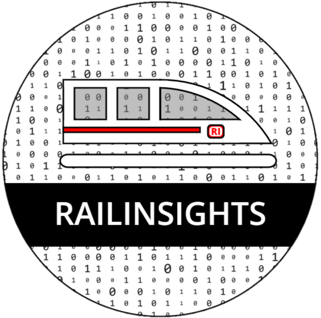
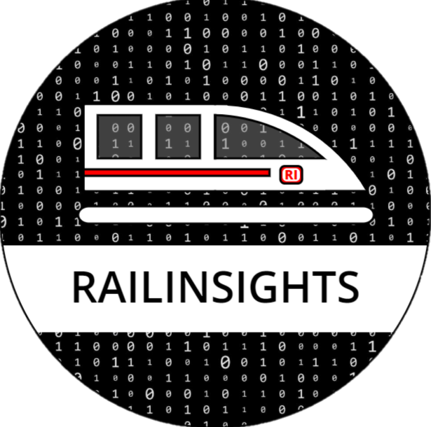

# Rail Insights

        

## Technologien

    

Rail Insights ist ein Softwareprojekt auf GitHub, das sich auf die Auswertung und statistische Darstellung von Zügen der
Deutschen Bahn konzentriert. Die zugehörige Webanwendung ermöglicht es Benutzern, in Echtzeit zu erfahren, welche Züge
wo fahren und welche Verspätungen diese haben.
Zusätzlich bietet die Anwendung eine Prognosefunktion für zukünftige Fahrten.

## Funktionalitäten

- **HomeView:** Die Startseite der Anwendung zeigt Statistiken über die ausgewerteten Daten.
- **Verspätungsanzeige:** Die Anwendung zeigt an, welche Züge Verspätungen haben und ermöglicht es den Benutzern,
  detaillierte Informationen zu erhalten.
- **Statistiken nach Zug:** Die Anwendung zeigt Statistiken über eine Linie in einem gewählten Zeitraum an.
- **Prognosefunktion:** Benutzer können eine Prognose für voraussichtliche Fahrten anzeigen lassen.
- **Echtzeitdaten:** Die Anwendung zeigt eine Karten mit Bahnhöfen an und man kann sich Details zu diesen anzeigen
  lassen.
- **CSV-Export:** Die Anwendung ermöglicht es Benutzern, die ausgewerteten Daten als CSV-Datei zu exportieren.

## Technologien

Die Webanwendung wurde unter Verwendung der folgenden Technologien erstellt:

- **Vaadin:** Ein Java-Framework für die Entwicklung von Webanwendungen, das eine moderne und benutzerfreundliche
  Oberfläche bietet.
- **Spring Boot v3:** Ein umfassendes Framework für die Entwicklung von Java-Anwendungen, das die Implementierung von
  Unternehmensanwendungen erleichtert.
- **MariaDB:** Ein relationales Datenbankmanagementsystem, das als Open-Source-Software verfügbar ist.

## Nutzung

Die Webseite des Projekts lautet [Railsights](https://www.railinsights.de).

## Beitrag und Mitwirkung

Wir begrüßen Beiträge und Feedback von der Community.

##  / Recent activity 

## Lizenz

Dieses Projekt ist unter der [GNU General Public License](LICENSE) lizenziert - siehe die Datei LICENSE für weitere
Details.

---

**Hinweis:** Dieses Projekt wird
von [olech2412](https://github.com/olech2412), [whosFritz](https://github.com/whosFritz) und Eric Jarka entwickelt.
Besuchen Sie
das [Repository](https://github.com/whosFritz/Rail-Insights) für weitere Informationen und um das Projekt zu fork-en
oder zu klonen.
